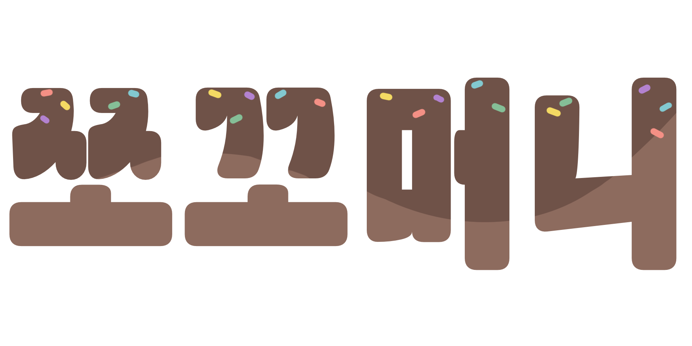
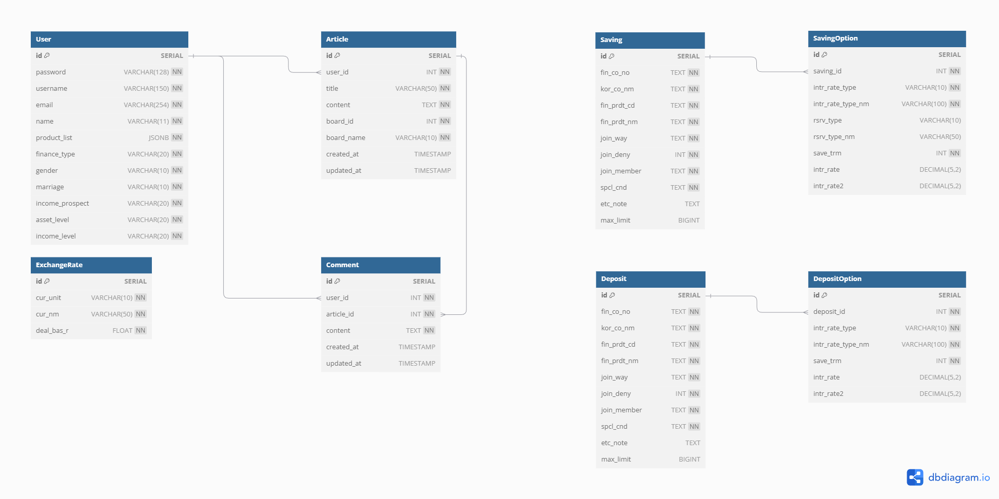
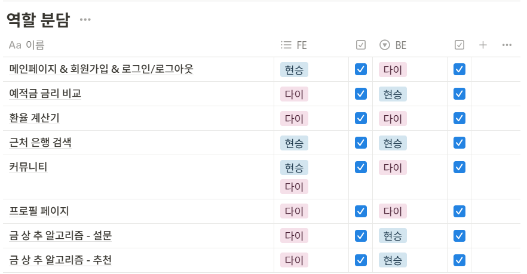
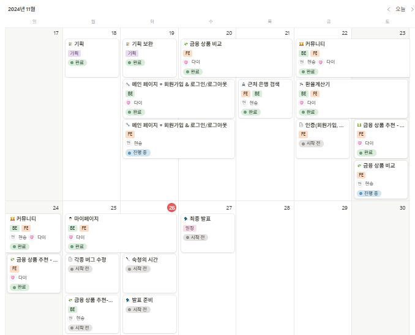

<div align="center">
  
</div>

## 프로젝트 개요
- 예적금 상품 조회 및 추천 서비스
- 기간: 2024.11.18 ~ 2024.11.26

## 기획의도
- 너무나도 어려운 금융! 쉽고 재미있게 금융 상품을 추천해주는 방법은 없을까 고민하던 중, 각자의 특성에 맞는 금융 상품을 추천해주는 웹 서비스를 개발하고자 하였습니다.
- 쪼꼬머니는 간단한 설문을 통해 사용자의 금융 성향을 분석하고, 이를 바탕으로 적절한 예적금 상품을 추천해주는 서비스입니다.
- 또한 간편하게 금융 상품들을 비교하고, 커뮤니티를 통해 내가 알고 있는 정보들을 공유하며 똑똑한 금융 습관을 만들 수 있습니다.

## 팀 소개

<table>
  <tr>
    <td align="center"><a href="https://github.com/hyvnsevng"><br /><sub><b>
 여현승</b></sub></a><br /></td>
    <td align="center"><a href="https://github.com/ebeleey"><br /><sub><b>
이다이</b></sub></a><br /></td>
</table>


## 주요 기능
### 회원 인증 관련
#### 회원가입
- 필수 입력 정보
- 아이디 중복 허용 X
- 비밀번호 확인
- 회원가입 시 회원 정보(성별, 미래 소득 전망, 총 자산 규모, 연평균 수입 등) 입력받아 금융 상품 추천에 활용
#### 로그인 및 로그아웃
- 토큰 인증 방식
- 로그인 상태에 따라 화면 표시 달라짐
#### 마이페이지
- 내 정보 조회 및 수정 가능
- 내가 가입한 금융 상품 목록 조회 가능
  - 가입 상품들의 금리를 차트로 시각화하여 비교 가능

### 금융 상품 조회
- 금융상품통합비교공시 API를 통해 예적금 상품들의 정보 조회
- 은행, 저축 기간, 이자 계산 방식, 가입 대상, 가입 방법 별로 필터링 가능
- 상품명으로 검색 기능 구현
- 기본 금리 및 최고 우대 금리 순으로 정렬하여 조회 가능
  - 내림차순/오름차순 토글

### 금융 상품 추천
- 간단한 설문을 통해 금융 성향 분석
- 사용자의 금융 성향과 정보에 맞는 금융 상품 추천
- 협업 필터링 기반 추천 알고리즘 활용
- 생성형 AI를 활용해 20000명 유저의 더미 데이터 DB에 저장
- 유사도가 높은 상위 100명의 유저가 가장 많이 가입한 상품 3가지 추천
- 생성형 AI를 활용해 추천 상품에 대한 설명과 추천 사유 표시
### 환율 계산
- 현재 환율 API를 활용해 환율 계산하기
### 주변 은행 검색
- 광역시/도, 시/군/구, 은행을 선택하여 특정 지역의 특정 은행 위치 검색 가능
- 검색 결과를 지도에 마커로 표시
### 커뮤니티
- 자유 게시판과 금융꿀팁 게시판으로 분류
  - 전체 게시판에서 모두 조회 가능
- 게시판 및 댓글 CRUD
  - 로그인 한 사용자만 게시글 및 댓글 작성 가능
  - 자신이 작성한 게시글과 댓글만 수정 및 삭제 가능


## 깃허브 협업

### 브랜치 전략- Github Flow
- **메인 브랜치**: `main`
  - 항상 배포 가능한 상태를 유지
  - 모든 Pull Request는 이 브랜치로 머지
- **기능 브랜치**: `feature/기능명`
  - 새로운 기능 추가 시 생성
  - 예: `feature/login`, `feature/signup`, `feature/product-comparison`

### 커밋 규칙
- **커밋 메시지 형식**
  - **타입**: `feat`(새로운 기능), `fix`(버그 수정), `docs`(문서 수정), `chore`(기타 변경)
  - **커밋 메시지 본문**: 작업 후 명확한 메시지로 커밋하기
    ```bash
    git commit -m "feat: 로그인 페이지 UI 구현 (FE)"
    git commit -m "feat: 로그인 API 추가 및 검증 로직 구현 (BE)"
    ```
- **커밋 빈도**
  - 작은 단위로 자주 커밋

### 작업 규칙
1. `main` 브랜치는 직접 수정하지 않습니다.
2. 새로운 작업은 항상 `feature/기능명` 브랜치에서 시작합니다.
    ```bash
    git checkout -b feature/{기능명}
    ```
3. 프론트엔드(FE)와 백엔드(BE)는 같은 기능 브랜치에서 작업합니다.
4. 작업 완료 후 `main`으로 Pull Request 작성 및 리뷰 진행
5. Pull Request 작성 시, 변경 사항과 테스트 내용을 상세히 기재합니다.
6. 모든 머지는 코드 리뷰를 통해 진행합니다.
5. 머지가 완료되면 해당 기능 브랜치를 삭제하여 저장소를 정리합니다.
    ```bash
    git branch -d feature/{기능명}
    ```

## 개발환경
### Backend
  


### Frontend
  
   

### Collaboration
  

### Tools
  


## 프로젝트 폴더 구조
```
zzocco-money
├─back
│  └─zzocco_money
│      ├─accounts
│      │  ├─migrations
│      │  │  └─__pycache__
│      │  └─__pycache__
│      ├─articles
│      │  ├─migrations
│      │  │  └─__pycache__
│      │  └─__pycache__
│      ├─currency
│      │  ├─migrations
│      │  │  └─__pycache__
│      │  └─__pycache__
│      ├─savings
│      │  ├─migrations
│      │  │  └─__pycache__
│      │  └─__pycache__
│      └─zzocco_money
│          └─__pycache__
└─front
│  requirements.txt
├─venv
└─zzocco_money
    │  .env
    │  db.sqlite3
    │  manage.py
    │  
    ├─accounts
    │  │  admin.py
    │  │  apps.py
    │  │  dummy_user_data_updated.csv
    │  │  models.py
    │  │  serializers.py
    │  │  signals.py
    │  │  tests.py
    │  │  urls.py
    │  │  views.py
    │  │  __init__.py
    │  │  
    │  ├─migrations // migrations 관련 파일   
    │  └─__pycache__
    │ 
    ├─articles
    │  │  admin.py
    │  │  apps.py
    │  │  models.py
    │  │  serializers.py
    │  │  tests.py
    │  │  urls.py
    │  │  views.py
    │  │  __init__.py
    │  │  
    │  ├─migrations
    │  └─__pycache__
    │          
    ├─currency
    │  │  admin.py
    │  │  apps.py
    │  │  models.py
    │  │  tests.py
    │  │  urls.py
    │  │  views.py
    │  │  __init__.py
    │  │  
    │  ├─migrations
    │  │  │  
    │  │  └─__pycache__
    │  │          
    │  └─__pycache__
    │          
    ├─savings
    │  │  admin.py
    │  │  apps.py
    │  │  models.py
    │  │  serializers.py
    │  │  tests.py
    │  │  urls.py
    │  │  views.py
    │  │  __init__.py
    │  │  
    │  ├─migrations
    │  │  │  
    │  │  └─__pycache__
    │  │          
    │  └─__pycache__
    │          
    └─zzocco_money
        │  asgi.py
        │  settings.py
        │  urls.py
        │  wsgi.py
        │  __init__.py
        │  
        └─__pycache__
```
## ERD

## 역할 분담

## 개발 일정

## 사용한 데이터
- 금융감독원 금융상품통합비교공시 API
- 한국수출입은행 현재환율 API
- KAKAO 지도 API
- OpenAI API
- 생성형 AI를 통해 생성한 20000개의 유저 더미 데이터

## 느낀 점
- **다이**

지난 5개월 동안 배운 내용을 토대로 이번 프로젝트를 진행하며 정말 많은 것을 배웠다. 프로젝트를 시작할 때만 해도 백엔드와 프론트엔드 간의 데이터 통신이 정확히 어떻게 이루어지는지 제대로 이해하지 못했지만, 이번 관통 프로젝트를 진행하는 동안 지난 몇 달간의 시간만큼이나 큰 성장을 한 것 같다. 단순히 화면에 변수 하나 출력하는 것도 어려웠던 시작 단계와 비교하면, 이제는 데이터를 주고받고 화면에 보여주는 작업을 훨씬 더 자연스럽게 처리할 수 있게 되어 뿌듯하다!

팀을 짜고 처음에 정했던 각자의 역할과 목표가 프로젝트를 진행하면서 계속해서 바뀌었다. 그러면서 내가 맡은 역할을 제대로 수행하고 있는지 의심스럽고, 때로는 제 몫을 못 하고 있다는 불안감이 들기도 했다. 그런데 페어와 대화를 나누며 내 페어도 나랑 똑같은 생각을 하고 있었다는 걸 알게 되었고, 서로의 응원과 신뢰가 프로젝트 기간 동안 큰 힘이 되었다. 협업은 단순히 각자의 역할을 나누는 것 뿐만 아니라, 서로의 부족한 점을 채우고 함께 더 나은 결과물을 만들어가는 과정이라는 것을 느낄 수 있었다!!

- **현승**

약 다섯 달 동안 배운 내용을 프로젝트에 적용한다는 것이 굉장히 뜻깊었다. 사실 단순히 학습을 통해 지식을 습득하는 것과, 이를 실제 적용하는 것은 너무나도 큰 차이가 있지만 이번 관통 프로젝트를 통해 더욱 실감이 났다. 

초기에 기획했던 것들을 전부 구현하지는 못해 아쉬움이 많이 남는다. 프로젝트를 통해 느낀 또 다른 하나는 일정 관리가 매우 중요하다는 점이다. 하루에 목표한 일을 다 끝내는 것도 중요하지만, 목표한 일보다 더 많이 하거나 더 적게 했을 때에도, 그에 맞춰서 유동적인 계획을 세우는 것이 성공적인 프로젝트로 이끄는 지름길이라는 것을 깨달았다. 또한 팀원과의 활발한 소통이 없으면 이것을 이루지 못한다는 사실도 깨달았다.

첫 프로젝트라 미숙한 점도 많았고, 목표한 것들을 모두 구현하진 못했지만 1주가 조금 넘는 기간동안 잠을 줄여가며 너무나도 수고해준 내 페어 다이 덕분에 어느정도 만족할만한 결과물을 얻을 수 있었다. 고맙다 내 페어 다이!